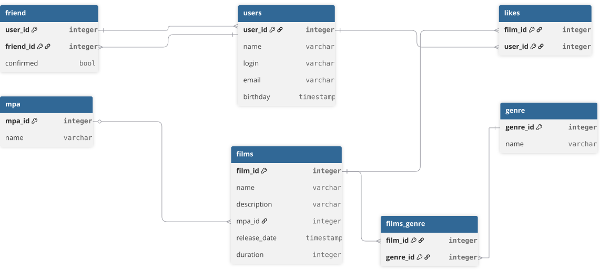

# Project java-filmorate

A social movie rating service developed as part of the **Yandex Practicum Java Developer** program.  
Users can rate films, add reviews, manage friendships, and view activity feeds.  
The final sprint was completed **collaboratively by a team of 4 developers**.

---

## **Features**
- User management: create, update, friendships, mutual friends  
- Films: likes, genres, MPA ratings, directors  
- Reviews: usefulness rating, likes/dislikes  
- Activity feed: friends, likes, reviews  
- Popular films (by likes, by director, by year)  
- Full PostgreSQL persistence

---

## **Technologies**
- **Java 11** — core language  
- **Spring Boot** — REST API, dependency injection  
- **Spring JDBC** — database access  
- **PostgreSQL** — relational storage  
- **Lombok** — boilerplate reduction  
- **JUnit + Mockito** — unit and integration testing  
- **Maven** — build and dependency management

---

## **Project Structure**
```
model/       # Film, User, Review, Director, Genre, Mpa, Event
service/     # Business logic for films, users, reviews, directors
storage/     # JDBC storages + RowMappers
controller/  # REST controllers
resources/   # schema.sql, data.sql, application.properties
```

---

## **Database**
- PostgreSQL schema defined in `schema.sql`  
- Initial data in `data.sql`  
- Many‑to‑many relations: film_genre, film_likes, user_friends  
- Activity feed stored as events

---

## **How to Run**
1. Create PostgreSQL database  
2. Configure `application.properties`  
3. Run:
   ```
   mvn spring-boot:run
   ```
---

## **Team**
Final sprint completed by **4 developers**, working together on storage, reviews, directors, and activity feed modules.

--- 

#### Here is a database schema used in the project and examples of SQL queries.

   ```
CREATE TABLE IF NOT EXISTS users (
user_id INTEGER  GENERATED BY DEFAULT AS IDENTITY PRIMARY KEY,
name varchar(40),
login varchar(20) NOT NULL CHECK (TRIM(login) <> ''),
email varchar(40) NOT NULL CHECK (TRIM(email) <> ''),
birthday date
);

INSERT INTO users (name, login, email, birthday)
VALUES ('John Doe', 'johndoe', 'john@example.com', '1990-05-15');

INSERT INTO friends (user_id, friend_id, confirmed)
VALUES (1, 2, FALSE);

INSERT INTO films (name, description, mpa_id, release_date, duration)
VALUES ('Film', 'Description', 3, '2010-07-16', 148);

SELECT u.* FROM users u
JOIN likes l ON u.user_id = l.user_id
WHERE l.film_id = 5;

   ```

## Спринт 13.
### Командный проект.

####  Реализовывали:

<table>
<tr><td>Задача</td><td>Участник</td><td>Аккаунт</td></tr>
<tr><td>Функциональность «Лента событий»</td><td>Наталья Карачевцева</td><td>Nataly-create</td></tr>
<tr><td>Вывод самых популярных фильмов по жанру и годам</td><td>Наталья Карачевцева</td><td>Nataly-create</td></tr>
<tr><td>Функциональность «Отзывы»</td><td>Иван Волосков</td><td>IvanVoloskov</td></tr>
<tr><td>Функциональность «Общие фильмы»</td><td>Иван Волосков</td><td>IvanVoloskov</td></tr>
<tr><td>Удаление фильмов и пользователей</td><td>Виталий Лазовиков</td><td>LaVV10</td></tr>
<tr><td>Добавление режиссёров в фильмы</td><td>Виталий Лазовиков</td><td>LaVV10</td></tr>
<tr><td>Функциональность «Поиск»</td><td>Григорий Романов</td><td>nottlegit</td></tr>
<tr><td>Функциональность «Рекомендации»</td><td>Григорий Романов</td><td>nottlegit</td></tr>
</table>
